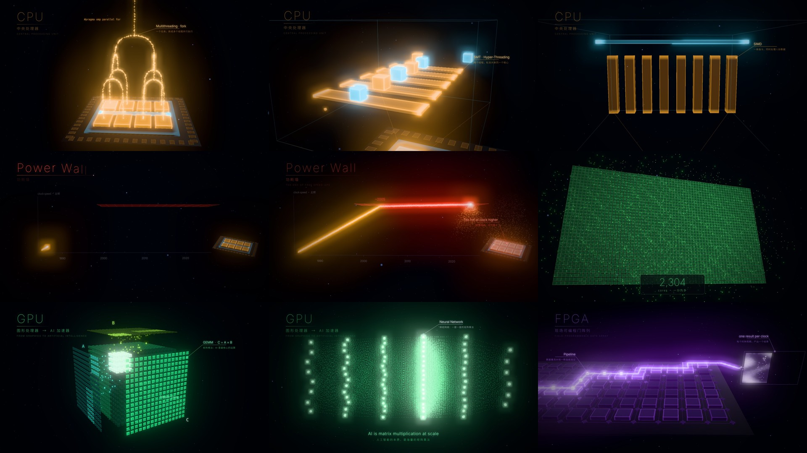

# HPC 之美 · The Beauty of Parallelism (3D)

A 90-second, beat-synced 3D particle animation that shows first-year computer-science students why parallel
computing is beautiful. It follows one idea through four kinds of hardware: CPUs (multithreading, SMT, SIMD), the
power wall, GPUs as AI accelerators, and FPGAs as reconfigurable hardware. It ends with all three working together.

**▶ Live demo: <https://gaoxiaohan2000.github.io/HPC-Beauty-of-Parallelism/>** (open it in Chrome)

- **Author:** 意雨轻寒 / Jerry Leibniz
- **Stack:** Three.js r169 + WebGL2 + GLSL (custom particle and glow shaders) + WebCodecs export
- **Soundtrack:** an original cyber-electronic score (120 BPM, A minor), synthesised from scratch in Python. Every hit is placed on a picture event.



## 1. Render the video (nothing to install)

1. Open the **live demo** in **Chrome**. Or download [`docs/index.html`](docs/index.html) and open it in Chrome; it is one
   self-contained file with the fonts, music and Three.js embedded.
2. When the status bar shows `ready · WebGL 2.0 …`, you can preview:
   - `Space` plays or pauses (with music); drag the timeline to jump to any second
   - `← / →` move one beat; `Shift + ← / →` move two seconds
   - the chapter buttons above the timeline jump straight to a section: 序 Intro / CPU / 功耗墙 Power Wall /
     转折 Split / GPU / FPGA / 协作 Heterogeneous / 终 Finale
3. Choose **1080p** and click **导出 MP4** (Export MP4). Every frame is rendered offline at its exact timestamp,
   independent of real-time playback, so the beat sync is frame-exact. The frames are encoded with the browser's
   hardware encoder (WebCodecs) and the file `HPC_Beauty_of_Parallelism_3D_1080p.mp4` downloads automatically.
   **取消** cancels the export.
4. When the export finishes, the status bar shows which encoders were used, e.g. `H.264 High + AAC`.

> If it reports `VP9 + Opus`, this browser cannot encode H.264/AAC. The file is still valid and plays in Chrome and
> VLC, but not in QuickTime. Chrome on macOS normally uses H.264 + AAC.

## 2. Build from source

```bash
npm install                      # three, mp4-muxer, esbuild
node build.mjs                   # → docs/index.html (also the page served by GitHub Pages)
```

| File | What it does |
|---|---|
| `src/main.js` | Renderer, bloom post-processing, timeline, chapter-cut flashes, preview UI |
| `src/scenes/cpu.js` | CPU: the lid lifts → fork/join threads as particle streams → magnified hologram of one core (SMT, SIMD) |
| `src/scenes/wall.js` | Power Wall: a particle clock-speed curve hits a glass ceiling; the chip overheats and sheds embers |
| `src/scenes/split.js` | Split: one core divides on every beat, 1 → 9,216 |
| `src/scenes/gpu.js` | GPU → AI: GEMM on Tensor Cores → thousands of cores in lockstep → particles morph into a neural network |
| `src/scenes/fpga.js` | FPGA: logic blocks wire themselves into a pipeline on the beat; packets step through; results fill column by column |
| `src/scenes/coop.js` | Heterogeneous computing: the CPU dispatches work; the results merge into a three-armed, three-colour particle galaxy |
| `src/scene2d.js` | Intro and finale (faithful ports of the original Python version) |
| `src/overlay.js` | Text layer: kinetic chapter titles, leader-line callouts anchored to 3D objects, taglines |
| `src/export.js` | WebCodecs export (H.264/AAC first, VP9/Opus fallback) |
| `src/util.js` | Time, beat grid (120 BPM), palette, camera keyframes |
| `music/synth.py` | Synthesis engine: oscillators, synth voices, drums, cinematic FX, mixing and mastering |
| `music/score.py` | The cyber-electronic arrangement; every musical event is placed on a picture event (timings in `EV` in `synth.py`) |

Every frame is a pure function of time `t` (`renderAt(t)`), so preview, scrubbing and export produce identical images.
The timeline and chapter boundaries are locked to the music, so keep animation changes on the 120 BPM grid
(one beat = 0.5 s).

**Regenerating the soundtrack** (requires Python + NumPy/SciPy + ffmpeg):

```bash
cd music && python score.py && cd ..   # → music/music.wav (about 30 s)
python prepare_assets.py               # → assets/music.ogg, and re-subsets the fonts
node build.mjs
```

**About the fonts:** to keep the single-file HTML small, the fonts in `assets/` only contain the characters used in
the film. If you add text with a Chinese character that is not in the subset, Chrome falls back to a system font
(PingFang on macOS). To keep a consistent typeface, re-create the subsets with `prepare_assets.py` (requires
fontTools; point the font paths in the script at your local Noto Sans CJK SC and Inter files).

## 3. Third-party notices

| Component | License | File |
|---|---|---|
| [three.js](https://github.com/mrdoob/three.js) r169 | MIT | `licenses/three.js-MIT.txt` |
| [mp4-muxer](https://github.com/Vanilagy/mp4-muxer) | MIT | `licenses/mp4-muxer-MIT.txt` |
| Inter (subset) | SIL Open Font License 1.1 | `licenses/font-Inter.txt` |
| Noto Sans CJK SC (subset) | SIL Open Font License 1.1 | `licenses/font-NotoSansCJK.txt` |
| DejaVu Sans Mono (subset) | Bitstream Vera / DejaVu license | `licenses/font-DejaVu.txt` |

`docs/index.html` bundles these components. The three.js license notice is kept at the end of that file, and the
full license texts are in `licenses/`.
